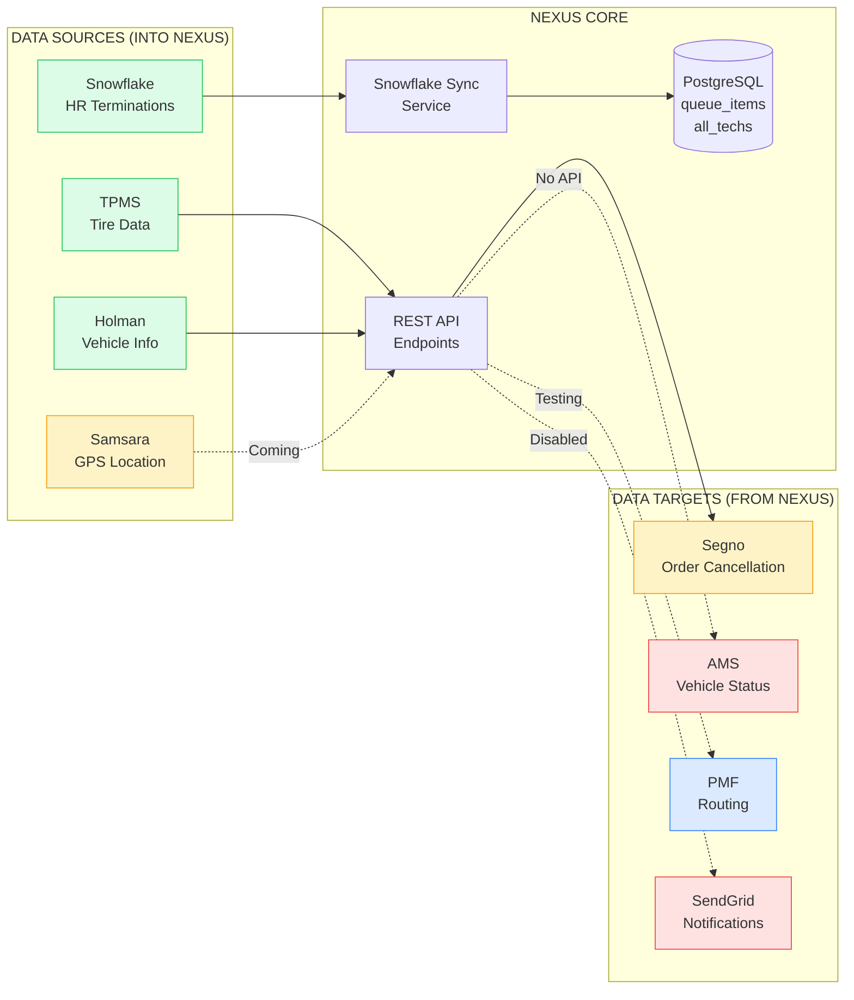
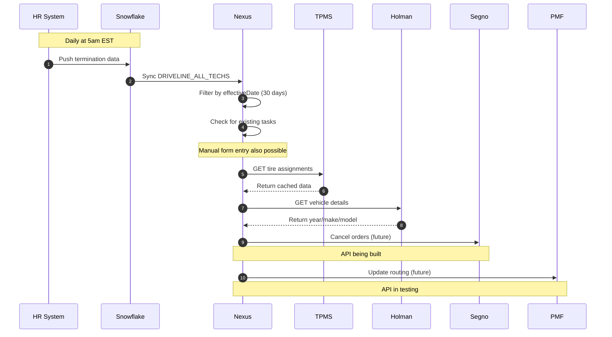
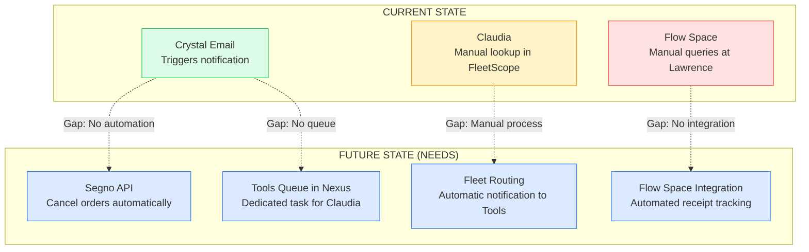

# Nexus Integration Landscape Diagram

**Owner:** Tim Motard (Nexus)  
**Purpose:** Visual map of all system integrations for Nexus offboarding  
**Last Updated:** January 30, 2026

---

## Overview

This diagram shows the integration status of all systems connected to (or planned for) Nexus offboarding workflows.

**Source:** INS-004 (Nexus Integration Landscape), Technical Audit Jan 29, 2026

---

## Integration Status Map

```mermaid
flowchart TD
    subgraph NEXUS["NEXUS PLATFORM"]
        CORE[Nexus Core<br/>Offboarding Module]
    end
    
    subgraph OPERATIONAL["OPERATIONAL"]
        TPMS[TPMS<br/>Tire Pressure<br/>GET only]
        HOLMAN[Holman<br/>Vehicle Details<br/>GET + POST]
        SNOWFLAKE[Snowflake HR Sync<br/>Daily 5am EST]
    end
    
    subgraph IN_PROGRESS["IN PROGRESS"]
        SEGNO[Segno<br/>Tool Listings<br/>API being stood up]
        AMS[AMS<br/>Vehicle Assignments<br/>DB access obtained]
        SAMSARA[Samsara<br/>GPS Data<br/>Coming soon]
    end
    
    subgraph DISABLED["DISABLED"]
        SENDGRID[SendGrid<br/>Email Automation<br/>Pending OneCard]
    end
    
    subgraph TESTING["TESTING"]
        PMF[PMF<br/>Vehicle Storage<br/>API in testing]
    end
    
    subgraph NOT_INTEGRATED["NOT INTEGRATED"]
        FLOWSPACE[Flow Space<br/>Lawrence Warehouse<br/>No integration]
    end
    
    subgraph COMING["COMING SOON"]
        RENTALS[Rentals<br/>Via Snowflake connector]
    end
    
    CORE --> TPMS
    CORE --> HOLMAN
    CORE --> SNOWFLAKE
    CORE -.->|In progress| SEGNO
    CORE -.->|In progress| AMS
    CORE -.->|Coming| SAMSARA
    CORE -.->|Disabled| SENDGRID
    CORE -.->|Testing| PMF
    CORE -.->|Gap| FLOWSPACE
    CORE -.->|Coming| RENTALS
    
    click FLOWSPACE "/project-memory/synthesis/PROJECT_INSIGHTS.md#ins-004" "INS-004: Integration Landscape"
    click RENTALS "/project-memory/synthesis/PROJECT_INSIGHTS.md#ins-004" "INS-004: Rentals via Snowflake"
    
    style TPMS fill:#dcfce7,stroke:#22c55e
    style HOLMAN fill:#dcfce7,stroke:#22c55e
    style SNOWFLAKE fill:#dcfce7,stroke:#22c55e
    style RENTALS fill:#fef3c7,stroke:#f59e0b
    style SEGNO fill:#fef3c7,stroke:#f59e0b
    style AMS fill:#fef3c7,stroke:#f59e0b
    style SAMSARA fill:#fef3c7,stroke:#f59e0b
    style SENDGRID fill:#fee2e2,stroke:#ef4444
    style PMF fill:#dbeafe,stroke:#3b82f6
    style FLOWSPACE fill:#fee2e2,stroke:#ef4444,stroke-width:3px
```

---

## Detailed Integration Status

---

## System Detail Table

| System | Role | API Status | Data Type | Notes | Verification |
|--------|------|------------|-----------|-------|--------------|
| **TPMS** | Tire pressure monitoring | Operational | GET only | Results cached in `tpms_cached_assignments` | Code-Verified |
| **Holman** | Vehicle details | Operational | GET + POST | Auto-populates year/make/model/licensePlate | Code-Verified |
| **Snowflake HR Sync** | Termination data | Operational | Daily sync 5am EST | Uses `DRIVELINE_ALL_TECHS`, 30-day lookback | Code-Verified |
| **Segno** | Tool listings, onboarding data | In Progress | API being built | Luca working on this; critical for tool recovery | Per Tim |
| **AMS** | Vehicle assignments, repairs | In Progress | DB access only | No API; working on connectivity | Per Tim |
| **Samsara** | GPS, onboard diagnostics | Coming Soon | Streams every 15 min | Data flows to Snowflake | Per Tim |
| **PMF** | Controlled vehicle storage | Testing | API in testing | Default routing destination | Per Tim |
| **SendGrid** | Email automation | Disabled | Code exists | Pending OneCard team coordination | Code-Verified |
| **Rentals** | Rental vehicle data | Coming | Via Snowflake connector | Future integration | Per Tim |
| **Flow Space** | Lawrence warehouse receiving | Not Integrated | Manual queries only | Gap: No systematic check-in tracking | Claudia Demo |

---

## Data Flow for Offboarding

---

## Key Dependencies for Tools Recovery

---

## Color Legend

| Color | Meaning |
|-------|---------|
| Green (#dcfce7) | Operational/Working |
| Blue (#dbeafe) | Testing |
| Yellow (#fef3c7) | In Progress / Coming Soon |
| Red (#fee2e2) | Disabled/Gap/Not Integrated |

---

## Related Documentation

| Document | Reference |
|----------|-----------|
| INS-004 | Nexus Integration Landscape |
| INS-005 | AMS vs Holman Data Source Distinction |
| INS-006 | Samsara GPS Capability |
| RISK-001 | Tim Capacity |

---

*Created: January 30, 2026*
