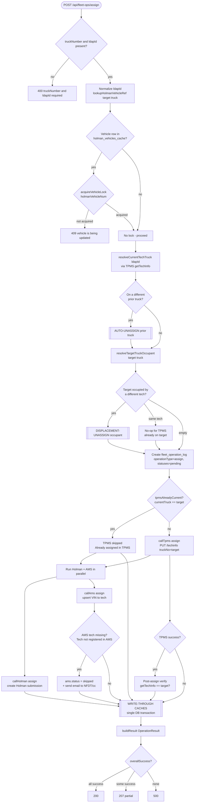
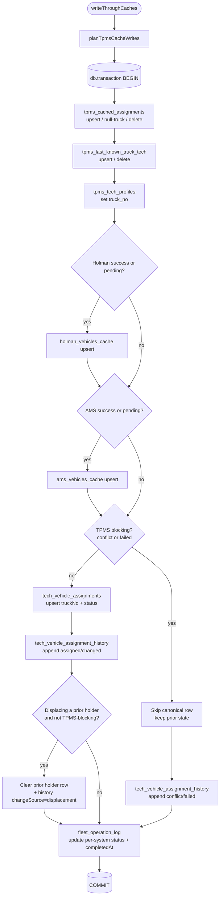

# Assign / Unassign Tech — Flowcharts & Data Sources

This document diagrams the **Assign Tech** and **Unassign Tech** flows end to end:
the decision logic, the systems that **provide** vs **receive** data at each step,
and sample request/response payloads. It is the shareable reference for how
technician-to-vehicle assignment is orchestrated across **TPMS**, **Holman**,
**AMS**, and **Nexus** (PostgreSQL).

> Rendering: the diagrams use Mermaid `flowchart` syntax, so they render directly
> in GitHub and VS Code (Markdown Preview Mermaid). To export PNG/PDF, paste a
> diagram block into <https://mermaid.live>.

> Scope note: this documents the flows as they exist in code at build time. No
> assign/unassign logic is changed by this document.

---

## Systems glossary

| System | What it is | Role in these flows |
| --- | --- | --- |
| **TPMS** | External tech-profile master (truck assignment + contact info). | Source of truth for which truck a tech is on. Written via `PUT /techinfo`. |
| **Holman** | External fleet/vehicle system. | Receives vehicle↔tech assignment via a submission, then **confirmed** asynchronously from a fleet sync. |
| **AMS** | External asset-management system (VIN ↔ tech). | Receives assignment; can **skip** when the tech is not registered (triggers email). |
| **Snowflake** | Enterprise data warehouse (`all_techs` roster, TPMS extract). | Read-only roster lookups (names, district, employment status). |
| **Nexus PG** | This app's PostgreSQL (Drizzle ORM). | Local write-through caches + canonical assignment + audit history + operation log. |

### Nexus PostgreSQL tables touched

| Table (`shared/schema.ts`) | Purpose |
| --- | --- |
| `tpms_cached_assignments` | Local mirror of TPMS truck↔tech assignments. |
| `tpms_last_known_truck_tech` | Last-known truck↔tech pairing (backstop). |
| `tpms_tech_profiles` | Cached TPMS tech profile (incl. `truck_no`). |
| `holman_vehicles_cache` | Local mirror of Holman vehicle assignment state. |
| `ams_vehicles_cache` | Local mirror of AMS VIN↔tech state. |
| `tech_vehicle_assignments` | **Canonical** current assignment per tech. |
| `tech_vehicle_assignment_history` | Append-only audit of every change. |
| `fleet_operation_log` | Per-operation log with per-system status columns. |

---

# 1. Assign Tech

**Route:** `POST /api/fleet-ops/assign` (`server/routes.ts:17760`)
**Service:** `fleetOpsService.assignTech` (`server/fleet-operations-service.ts:1211`)
**Write-through:** `writeThroughCaches` (`server/fleet-operations-service.ts:957`)

The assign flow can fan out into **up to three** logical operations before the
main assign even runs:

1. **Auto-unassign** the incoming tech from any *prior* truck.
2. **Displacement-unassign** whoever currently occupies the *target* truck.
3. The **main assign** to the target truck (TPMS + Holman + AMS), followed by a
   single-transaction local write-through.

## 1.1 Flowchart



### Auto-unassign / Displacement-unassign subroutine

Both pre-steps share the same shape (only the target truck + tech differ):

```mermaid
flowchart TD
    A([Pre-unassign step]) --> B[Create fleet_operation_log<br/>operationType=unassign, statuses=pending]
    B --> C[In parallel:<br/>callTpms unassign<br/>callHolman unassign<br/>callAms unassign]
    C --> D[writeThroughCaches action=unassign<br/>changeSource = auto_unassign | displacement]
    D --> E[logAllEvents]
```

## 1.2 Write-through transaction (single DB tx)

`writeThroughCaches` plans all cache mutations, then commits them atomically so a
partial failure can never leave one tech pointing at a truck while the prior
holder still claims it.



## 1.3 Provides vs Receives — Assign

| Step | Provides (read) | Receives (write) |
| --- | --- | --- |
| Resolve vehicle ref / lock | `holman_vehicles_cache` | `fleet_operation_log` lock row |
| Resolve current/prior truck | **TPMS** `getTechInfo` | — |
| Resolve target occupant | `holman_vehicles_cache`, TPMS truck cache | — |
| Auto/displacement unassign | TPMS / Holman / AMS | TPMS, Holman, AMS, all Nexus caches + history |
| TPMS assign | request body | **TPMS** `PUT /techinfo` (truckNo = target) |
| TPMS post-verify | **TPMS** `getTechInfo` | — (warns on mismatch only) |
| Holman assign | request body | **Holman** submission (later confirmed by fleet sync) |
| AMS assign | request body, `all_techs` (Snowflake) on skip-email | **AMS** VIN↔tech (or skip + email) |
| Write-through | plan from above | `tpms_*`, `holman_vehicles_cache`, `ams_vehicles_cache`, `tech_vehicle_assignments`, `tech_vehicle_assignment_history`, `fleet_operation_log` |

## 1.4 Data Sources table — Assign

| System | Read | Written | Notes |
| --- | --- | --- | --- |
| **TPMS** | ✅ (`getTechInfo`) | ✅ (`PUT /techinfo`) | Source of truth for truck assignment; skipped if tech already on target. |
| **Holman** | ✅ (cache for ref) | ✅ (submission) | Assignment confirmed asynchronously via fleet sync. |
| **AMS** | ✅ (BYOV/pre-check in `callAms`) | ✅ (VIN↔tech) | "Tech not registered" → skip + email, no cache write. |
| **Snowflake** | ✅ (`all_techs` for skip-email name lookup) | ❌ | Read-only roster. |
| **Nexus PG** | ✅ (caches, canonical row) | ✅ (all caches, canonical, history, op log) | All writes are one transaction. |

## 1.5 Sample payloads — Assign

**Request body** (`POST /api/fleet-ops/assign`):

```json
{
  "truckNumber": "46863",
  "ldapId": "KMICKEL",
  "districtNo": "1042",
  "techName": "Kyle Mickelson",
  "notes": "New route assignment",
  "assignmentType": "assigned",
  "amsStatusId": 1
}
```

**Response** — `OperationResult` (HTTP 200 all-success, 207 partial, 500 none):

```json
{
  "log": {
    "id": "c3f1b2a4-9e10-4f5d-bd2a-7b6e5d4c3a21",
    "operationType": "assign",
    "truckNumber": "46863",
    "toLdap": "KMICKEL",
    "toTechName": "Kyle Mickelson",
    "districtNo": "1042",
    "tpmsStatus": "success",
    "holmanStatus": "pending",
    "amsStatus": "success",
    "requestedBy": "tmotard",
    "notes": "New route assignment",
    "completedAt": "2026-06-03T14:22:08.512Z"
  },
  "tpms":   { "status": "success", "message": "Tech assigned to truck 046863" },
  "holman": { "status": "pending", "message": "Submitted to Holman — awaiting fleet sync confirmation" },
  "ams":    { "status": "success", "message": "AMS updated for VIN 1FTBW2CM5KKB12345" },
  "overallSuccess": false,
  "partialSuccess": true
}
```

**AMS "tech missing" variant** (assignment otherwise succeeds, AMS skipped + email sent):

```json
{
  "ams": { "status": "skipped", "message": "Tech not registered in AMS" }
}
```

---

# 2. Unassign Tech

There are **two** unassign entry points. They share the same goal — clear the
tech's truck and audit it — but differ in how far they reach into external systems.

| Entry point | Route → Service | External systems | Response type |
| --- | --- | --- | --- |
| **A. Lightweight (Nexus-only)** | `DELETE /api/vehicle-assignments/:techRacfid` (`server/routes.ts:13549`) → `vehicleAssignmentService.unassignVehicle` (`server/vehicle-assignment-service.ts:334`) | none (Nexus DB + enriched read) | `AggregatedVehicleAssignment` |
| **B. Cross-system** | `POST /api/fleet-ops/unassign` (`server/routes.ts:17779`) → `fleetOpsService.unassignTech` (`server/fleet-operations-service.ts:1480`) | TPMS + Holman + AMS | `OperationResult` |

The task's required confirmations (assignment-exists validation + Nexus clear +
audit append in **A**; TPMS + Holman external confirmations in **B**) live across
these two paths, so both are shown.

## 2.1 Flowchart — Entry A (lightweight, Nexus-only)

**Returns `AggregatedVehicleAssignment`.**

```mermaid
flowchart TD
    A([DELETE /api/vehicle-assignments/:techRacfid]) --> B{Caller role in<br/>developer/admin/agent?}
    B -- no --> B1[403 insufficient permissions]
    B -- yes --> C[unassignVehicle techRacfid, user, notes]

    C --> D[getTechVehicleAssignmentByTechRacfid]
    D --> E{Assignment exists?}
    E -- no --> E1[Return null then 404 Assignment not found]
    E -- yes --> F[Capture previousTruckNo]

    F --> G[(Nexus clear)<br/>tech_vehicle_assignments<br/>truckNo=null, status=inactive]
    G --> H{previousTruckNo set?}
    H -- yes --> I[Append tech_vehicle_assignment_history<br/>changeType=unassigned, source=manual]
    H -- no --> J
    I --> J[enrichAssignmentData]

    J --> K[Read Snowflake all_techs<br/>roster enrichment]
    K --> L[AggregatedVehicleAssignment]
    L --> M[200 success:true, data:assignment]
```

> In Entry A, `enrichAssignmentData` only re-reads **Holman** cache when the row
> still has a `truckNo`. After an unassign the truck is null, so the response is
> enriched from **Snowflake** (`all_techs`) only; `dataSources.holman = false`.

## 2.2 Flowchart — Entry B (cross-system, with TPMS + Holman confirmation)

**Returns `OperationResult`.** This is where the **TPMS** and **Holman** external
confirmations happen.

```mermaid
flowchart TD
    A([POST /api/fleet-ops/unassign]) --> B{truckNumber and ldapId present?}
    B -- no --> B1[400 required]
    B -- yes --> C[lookupHolmanVehicleRef + acquireVehicleLock]
    C --> C1{Lock acquired?}
    C1 -- no --> C2[409 vehicle is being updated]
    C1 -- yes --> D[Create fleet_operation_log<br/>operationType=unassign, statuses=pending]

    D --> E[Run in parallel]
    E --> F[callTpms unassign<br/>PUT /techinfo truckNo=empty]
    E --> G[callHolman unassign<br/>create Holman unassign submission]
    E --> H[callAms unassign]

    F --> I[[WRITE-THROUGH CACHES<br/>single tx]]
    G --> I
    H --> I
    I --> J[Nexus clear: tech_vehicle_assignments<br/>truckNo=null, status=inactive<br/>+ history changeType=unassigned]
    J --> K[logAllEvents + update op log statuses]
    K --> L[buildResult OperationResult]
    L --> M{overallSuccess? 200 / 207 / 500}

    G -. async .-> N[(Holman fleet sync verify)<br/>assignedStatus has unassign<br/>or tech blank then confirmed]
    N --> O[Mark submission completed<br/>propagate to fleet_operation_log]
```

> **TPMS confirmation:** unassign clears the truck via `PUT /techinfo` with
> `truckNo: ""` (`server/tpms-service.ts:438`, `server/tpms-api-service.ts:237`).
> **Holman confirmation:** the submission is verified later from the Holman fleet
> sync — `assignedStatus` containing "unassign" (or a blank tech) marks it
> confirmed (`server/holman-submission-service.ts:197`).

## 2.3 Provides vs Receives — Unassign

| Step | Provides (read) | Receives (write) |
| --- | --- | --- |
| Validate assignment exists (A) | `tech_vehicle_assignments` | — |
| Nexus clear (A & B) | prior row | `tech_vehicle_assignments` (truckNo=null, status=inactive) |
| Audit append (A & B) | prior truck | `tech_vehicle_assignment_history` (changeType=unassigned) |
| Response enrichment (A) | **Snowflake** `all_techs` (+ Holman cache if truck set) | — |
| TPMS unassign (B) | request | **TPMS** `PUT /techinfo` (truckNo="") |
| Holman unassign (B) | request | **Holman** submission |
| Holman confirm (B) | **Holman** fleet sync | `holman_submissions`, `fleet_operation_log` |
| AMS unassign (B) | request | **AMS** + `ams_vehicles_cache` |

## 2.4 Data Sources table — Unassign

| System | Read | Written | Notes |
| --- | --- | --- | --- |
| **TPMS** | ✅ (B confirm via cache) | ✅ (B: `PUT /techinfo` truckNo="") | Entry A does not touch TPMS. |
| **Holman** | ✅ (B: fleet sync verify) | ✅ (B: submission) | Confirmation is asynchronous. |
| **AMS** | ❌ | ✅ (B) | Entry A does not touch AMS. |
| **Snowflake** | ✅ (A: `all_techs` enrichment) | ❌ | Read-only roster. |
| **Nexus PG** | ✅ (canonical row) | ✅ (canonical clear, history, op log, caches in B) | Both entries write canonical + history. |

## 2.5 Sample payloads — Unassign

**Entry A — `DELETE /api/vehicle-assignments/KMICKEL`**

URL param: `techRacfid = KMICKEL`. Optional JSON body:

```json
{ "notes": "Tech off route — vehicle returned to pool" }
```

**Response** — `AggregatedVehicleAssignment`:

```json
{
  "success": true,
  "data": {
    "id": "8a2d4c6e-1f3b-4a9d-9c7e-5b2a1d0f4e88",
    "techRacfid": "KMICKEL",
    "assignmentStatus": "inactive",
    "truckNo": null,
    "lastTpmsSync": null,
    "employeeId": "00123456",
    "techName": "Kyle Mickelson",
    "firstName": "Kyle",
    "lastName": "Mickelson",
    "districtNo": "1042",
    "employmentStatus": "Active",
    "dataSources": { "snowflake": true, "tpms": false, "holman": false }
  }
}
```

**404 (no assignment):**

```json
{ "success": false, "message": "Assignment not found" }
```

**Entry B — `POST /api/fleet-ops/unassign`**

```json
{
  "truckNumber": "46863",
  "ldapId": "KMICKEL",
  "notes": "Cross-system unassign"
}
```

**Response** — `OperationResult`:

```json
{
  "log": {
    "id": "f7e6d5c4-b3a2-4910-8f7e-6d5c4b3a2910",
    "operationType": "unassign",
    "truckNumber": "46863",
    "fromLdap": "KMICKEL",
    "tpmsStatus": "success",
    "holmanStatus": "pending",
    "amsStatus": "success",
    "requestedBy": "tmotard",
    "notes": "Cross-system unassign",
    "completedAt": "2026-06-03T15:10:44.219Z"
  },
  "tpms":   { "status": "success", "message": "Tech unassigned in TPMS (truckNo cleared)" },
  "holman": { "status": "pending", "message": "Unassign submitted — awaiting fleet sync confirmation" },
  "ams":    { "status": "success", "message": "AMS VIN cleared for tech" },
  "overallSuccess": false,
  "partialSuccess": true
}
```

---

## Appendix — Source map

| Concern | Location |
| --- | --- |
| Assign route | `server/routes.ts:17760` |
| Unassign route (lightweight) | `server/routes.ts:13549` |
| Unassign route (cross-system) | `server/routes.ts:17779` |
| `assignTech` | `server/fleet-operations-service.ts:1211` |
| `unassignTech` | `server/fleet-operations-service.ts:1480` |
| `writeThroughCaches` | `server/fleet-operations-service.ts:957` |
| `unassignVehicle` (Nexus-only) | `server/vehicle-assignment-service.ts:334` |
| TPMS `PUT /techinfo` | `server/tpms-service.ts:438` |
| TPMS unassign wrapper | `server/tpms-api-service.ts:237` |
| Holman confirmation | `server/holman-submission-service.ts:197` |
| Schema (all tables) | `shared/schema.ts` |
