# Create Vehicle — Flowcharts, Data Sources & Review Questions

This document diagrams the **Create New Vehicle** flow end to end: the validation
and duplicate gates, the number reservation, the sequential fan-out to
**Holman → WMS → TPMS**, the single-system retry routes, and the audit
finalization. It is the shareable reference for a second developer reviewing the
duplicate-VIN and number-sequencing defects **before** the three companion fix
tasks are implemented.

> Rendering: the diagrams use Mermaid `flowchart` syntax, so they render directly
> in GitHub and VS Code (Markdown Preview Mermaid). To export PNG/PDF, paste a
> diagram block into <https://mermaid.live>.
>
> The same diagrams also ship as four Visio pages in
> `exports/Nexus_Flowcharts.vsdx`, rendering as tabs on the in-app
> **Nexus Flowcharts** page at `/flowcharts`, in this order:
> **`createVehicle`** — the full workflow drawn plain, in the same style as the
> other twelve pages; **`createVehicleGaps`** — the identical flow with every
> duplicate-leak path marked in red; **`createVehicleRetryPaths`**; and
> **`createVehicleProposed`**.

> **Scope note.** Sections 1–3 describe the code **as it exists today**. Section 5
> describes a **proposed** design that is *not implemented*; it belongs to three
> separate companion tasks. Nothing in this document changes Create Vehicle
> behaviour.

> **How to read the gap markers.** Read § 1.1 (Visio `createVehicle`) first —
> the workflow plain, with no annotations. § 1.2 (Visio `createVehicleGaps`)
> repeats the identical flow with every way a duplicate can survive drawn as a
> red **`GAP n`** node on the path it affects, not hidden in a footnote. Trace
> the edges into and out of a gap node to see exactly which branch reaches it.
> Section 4 restates each one with its code location.

---

## Systems glossary

| System | What it is | Role in this flow |
| --- | --- | --- |
| **Holman** | External fleet/vehicle system of record for the vehicle master record. | Receives the `ADD` submission (`POST /vehicles/submit`). Also the **duplicate authority** — queried live when the local cache misses. Acceptance is asynchronous. |
| **WMS** | External warehouse/truck-management system (NetSuite-backed). | Receives `POST /wms-engine/v1/trucks` so the vehicle exists as a truck/location with a cost center. |
| **TPMS** | External tech-profile master. | Receives `POST /addtruck` so the truck exists in the tech-profile system. Best-effort, non-fatal. |
| **AMS** | External asset-management system (VIN-keyed). | **Not written on create — by design.** See section 6. |
| **NHTSA vPIC** | Free public VIN decoder. | Client-side only: pre-fills Year/Make/Model/AssetType in the form. Not a duplicate check. |
| **Nexus PG** | This app's PostgreSQL (Drizzle ORM). | Number reservation, duplicate cache, audit trail. |

### Nexus PostgreSQL tables touched

| Table (`shared/schema.ts`) | Purpose in this flow |
| --- | --- |
| `byov_creation_audit` (`shared/schema.ts:2797`) | Doubles as the **number reservation** and the **audit trail**. A partial unique index — `byov_creation_audit_active_vehicle_uq ON (vehicle_number) WHERE blocked_source IS NULL` — allows at most one *active* row per number. `blocked_source` of `'cache'`/`'live'` marks a blocked attempt; `'failed'` marks a fully-failed create and **releases** the number. |
| `holman_vehicles_cache` | Local mirror of the Holman vehicle master. Read as the first-line duplicate check (by number **and** by VIN); written optimistically on a "successful" submit. |
| `district_cost_centers` (via `storage.getDistrictCostCenter`) | Cross-reference that supplies the WMS `costCenter` for the district. |

### Route & service references

| Concern | Location |
| --- | --- |
| Number suggestion | `GET /api/byov/next-number` — `server/routes.ts:9176` |
| **Main create** | `POST /api/byov/create` — `server/routes.ts:9279` |
| Reservation index DDL | `ensureByovReservationIndex` — `server/routes.ts:9066` |
| WMS-only retry | `POST /api/byov/create-wms-only` — `server/routes.ts:10227` |
| Holman-only retry | `POST /api/byov/create-holman-only` — `server/routes.ts:10356` |
| Audit history / export | `GET /api/byov/audit-log` — `server/routes.ts:10550` |
| Standalone VIN check (UI) | `GET /api/byov/check-vin/:vin` — `server/routes.ts:10798` |
| Holman submit | `holmanApiService.submitVehicleArray` — `server/holman-api-service.ts:275` |
| Holman duplicate lookup | `holmanApiService.findVehicleByNumber` |
| WMS create | `wmsEngineService.createTruck` — `server/wms-engine-service.ts:343` |
| TPMS register | `tpmsService.addTruck` — `server/tpms-service.ts:586` |
| Number canonicalisation | `toHolmanRef` / `toCanonical` — `shared/vehicle-number-utils.ts` |
| Create Vehicle UI | `client/src/pages/create-vehicle-location.tsx` |
| Flowchart viewer + VSDX parser | `client/src/pages/nexus-flowcharts.tsx`, `server/routes.ts:23437` |

---

# 1. Current flow — `POST /api/byov/create`

Visio pages: **`createVehicle`** (the workflow drawn plain, like the other
Nexus flowchart pages) and **`createVehicleGaps`** (the identical flow with the
failure branches marked in red).

The route is a single ~600-line handler that runs strictly in sequence:

1. **Required-field validation** — 18 fields, all-or-nothing.
2. **VIN duplicate gate** — local `holman_vehicles_cache` only, and only when
   `createInHolman` is true.
3. **Vehicle-number duplicate gate** — local cache (padded hit, then a full-table
   canonical rescan), then a **live** Holman lookup on cache miss. Only when
   `createInHolman` is true.
4. **Atomic number reservation** — insert an active `byov_creation_audit` row
   under the partial unique index. Same-VIN retries reuse the row; a different
   VIN is a 409; a stale row (>15 min, nothing created) is reclaimed by CAS.
5. **Fan-out**, strictly sequential: **Holman → cache upsert → WMS → TPMS**.
   TPMS only runs when WMS succeeded.
6. **Audit finalization** — stamp the reserved row with the per-system outcome.
   If *both* Holman and WMS failed, set `blocked_source='failed'`, which releases
   the number for reuse while keeping the row visible in history.

`createInHolman` and `createInWms` both default to `true`; a caller can target a
single system to repair a half-created vehicle, and doing so **skips that
system's gates entirely**.

## 1.1 Flowchart — the full workflow as built

The flow exactly as the route runs it today, drawn plain. Node for node it is
the same graph as § 1.2 — only the red `GAP` markers are absent. Visio page:
**`createVehicle`**.

```mermaid
flowchart TD
    S([Start]) --> NN[GET /api/byov/next-number<br/>max used in band + 1]
    NN --> A[POST /api/byov/create]

    A --> B{createInHolman or<br/>createInWms true?}
    B -- no --> B1([Return 400 — no target system])
    B -- yes --> C{vehicleNumber present?}
    C -- no --> C1([Return 400 — vehicleNumber required])
    C -- yes --> D[toHolmanRef pads to 6 digits]
    D --> E{All 18 required<br/>fields present?}
    E -- missing --> E1([Return 400 — missing required fields])

    E -- complete --> F{VIN is 17 chars and<br/>createInHolman true?}
    F -- no --> K
    F -- yes --> H[SELECT holman_vehicles_cache<br/>WHERE vin = normalised VIN]
    H --> I{VIN lookup threw?}
    I -- yes --> K
    I -- no --> J{VIN found under a<br/>different number?}
    J -- yes --> J1([Return 409 — VIN already registered])
    J -- no --> K

    K{createInHolman true?}
    K -- no --> Q
    K -- yes --> L[Direct cache hit on the padded number,<br/>then a full-table canonical rescan]
    L --> M{Number already in<br/>the local cache?}
    M -- yes --> N[INSERT byov_creation_audit blocked row<br/>blockedSource = cache or live]
    N --> N1([Return 409 — vehicle already exists in Holman])
    M -- no --> O[holmanApiService.findVehicleByNumber<br/>live duplicate lookup]
    O --> P{Live lookup threw?}
    P -- yes --> Q
    P -- no --> P2{Live Holman<br/>vehicle found?}
    P2 -- yes --> N
    P2 -- no --> Q

    Q[ensureByovReservationIndex] --> R{Index preparation failed?}
    R -- yes --> R1([Return 500 — could not prepare reservation])
    R -- no --> T[INSERT byov_creation_audit<br/>ON CONFLICT DO NOTHING]
    T --> U{Row inserted?}
    U -- yes --> V[Reservation claimed]
    U -- no --> W[SELECT the existing active row]
    W --> X{Same VIN?}
    X -- yes --> Y[Reuse the row; carry priorHolmanSuccess<br/>and priorWmsSuccess forward]
    X -- no --> Z{Older than 15 min<br/>with no successes?}
    Z -- no --> Z1([Return 409 — number assigned to a different vehicle])
    Z -- yes --> AA[CAS UPDATE guarded on id, blockedSource null,<br/>both flags false and the same submittedAt]
    AA --> AB{CAS reclaimed the row?}
    AB -- 0 rows --> AB1([Return 409 — number just claimed by another request])
    AB -- 1 row --> V

    V --> AC[Derive Holman payload, district prefix,<br/>WMS cost center, region 890]
    Y --> AC

    AC --> AD{createInHolman true?}
    AD -- no --> AS
    AD -- yes --> AE[Holman pre-check —<br/>findVehicleByNumber]
    AE --> AF{Already present<br/>in Holman?}
    AF -- yes --> AJ[holmanResult success true]
    AF -- no --> AG[Holman POST /vehicles/submit<br/>assetAction ADD]
    AG --> AH{Submit threw?}
    AH -- no --> AJ
    AH -- yes --> AI{Message matches duplicate,<br/>conflict or already exists?}
    AI -- yes --> AJ
    AI -- no --> AK[holmanResult success false,<br/>reason recorded]

    AJ --> AL{createInHolman and<br/>Holman reported success?}
    AK --> AL
    AL -- yes --> AM[UPSERT holman_vehicles_cache<br/>with the submitted values]
    AM --> AS
    AL -- no --> AS

    AS{createInWms true?}
    AS -- no --> BA
    AS -- yes --> AT[WMS pre-check — getTruck]
    AT --> AU{Truck already<br/>in WMS?}
    AU -- yes --> AX[wmsResult success true]
    AU -- "no or 404" --> AV[WMS createTruck — costCenter,<br/>regionNo 890, spareTruck true]
    AV --> AW{Threw something other than<br/>409 or already exists?}
    AW -- yes --> AY[wmsResult success false]
    AW -- no --> AX
    AX --> BA
    AY --> BA

    BA{createInWms and<br/>WMS succeeded?}
    BA -- no --> BE
    BA -- yes --> BB{TPMS configured?}
    BB -- no --> BC[tpmsResult skipped]
    BB -- yes --> BD[TPMS addtruck — regionNo,<br/>distNo, spareTruck true]
    BC --> BE
    BD --> BE

    BE[UPDATE the reserved audit row with<br/>the final per-system flags] --> BF{Both Holman and<br/>WMS failed?}
    BF -- yes --> BG[Set blockedSource = failed,<br/>releasing the number for reuse]
    BG --> BH([Return 200 with holman, wms, tpms, holmanOnly])
    BF -- no --> BH

    BH --> BI{Partial success needing<br/>single-system recovery?}
    BI -- "Holman missing" --> BJ[POST /api/byov/create-holman-only]
    BI -- "WMS missing" --> BK[POST /api/byov/create-wms-only]
    BI -- no --> BM([Return to the caller])
    BJ --> BM
    BK --> BM
```



## 1.2 Flowchart — the same flow with the failure branches marked

Identical to § 1.1 node for node — only the red `GAP n` markers are added, each
sitting on the exact branch it rides. Visio page: **`createVehicleGaps`**.

```mermaid
flowchart TD
    S([Start]) --> NN[GET /api/byov/next-number<br/>max used in band + 1]
    NN --> G10>"GAP 10 — the suggested number is never<br/>reserved, so two dispatchers can be<br/>handed the same one"]
    G10 --> A[POST /api/byov/create]

    A --> B{createInHolman or<br/>createInWms true?}
    B -- no --> B1([Return 400 — no target system])
    B -- yes --> C{vehicleNumber present?}
    C -- no --> C1([Return 400 — vehicleNumber required])
    C -- yes --> D[toHolmanRef pads to 6 digits]
    D --> E{All 18 required<br/>fields present?}
    E -- missing --> E1([Return 400 — missing required fields])

    E -- complete --> F{VIN is 17 chars and<br/>createInHolman true?}
    F -- no --> G1>"GAP 1 — a WMS-only create<br/>skips the VIN gate completely"]
    G1 --> K
    F -- yes --> H[SELECT holman_vehicles_cache<br/>WHERE vin = normalised VIN]
    H --> G3>"GAP 3 — VIN compared against the local<br/>cache only, never live in Holman"]
    G3 --> G4>"GAP 4 — no VIN claim is taken, so two<br/>concurrent same-VIN creates under different<br/>numbers both pass"]
    G4 --> I{VIN lookup threw?}
    I -- yes --> G2>"GAP 2 — the failure is logged and<br/>swallowed, so the create continues fail-open"]
    G2 --> K
    I -- no --> J{VIN found under a<br/>different number?}
    J -- yes --> J1([Return 409 — VIN already registered])
    J -- no --> K

    K{createInHolman true?}
    K -- no --> G5>"GAP 5 — a WMS-only create also skips<br/>the vehicle-number duplicate gate"]
    G5 --> Q
    K -- yes --> L[Direct cache hit on the padded number,<br/>then a full-table canonical rescan]
    L --> M{Number already in<br/>the local cache?}
    M -- yes --> N[INSERT byov_creation_audit blocked row<br/>blockedSource = cache or live]
    N --> N1([Return 409 — vehicle already exists in Holman])
    M -- no --> O[holmanApiService.findVehicleByNumber<br/>live duplicate lookup]
    O --> P{Live lookup threw?}
    P -- yes --> G6>"GAP 6 — the live lookup failure is swallowed;<br/>the create proceeds on a possibly stale cache"]
    G6 --> Q
    P -- no --> P2{Live Holman<br/>vehicle found?}
    P2 -- yes --> N
    P2 -- no --> Q

    Q[ensureByovReservationIndex] --> R{Index preparation failed?}
    R -- yes --> R1([Return 500 — could not prepare reservation])
    R -- no --> T[INSERT byov_creation_audit<br/>ON CONFLICT DO NOTHING]
    T --> U{Row inserted?}
    U -- yes --> V[Reservation claimed]
    U -- no --> W[SELECT the existing active row]
    W --> X{Same VIN?}
    X -- yes --> Y[Reuse the row; carry priorHolmanSuccess<br/>and priorWmsSuccess forward]
    X -- no --> Z{Older than 15 min<br/>with no successes?}
    Z -- no --> Z1([Return 409 — number assigned to a different vehicle])
    Z -- yes --> AA[CAS UPDATE guarded on id, blockedSource null,<br/>both flags false and the same submittedAt]
    AA --> AB{CAS reclaimed the row?}
    AB -- 0 rows --> AB1([Return 409 — number just claimed by another request])
    AB -- 1 row --> V

    V --> AC[Derive Holman payload, district prefix,<br/>WMS cost center, region 890]
    Y --> AC

    AC --> AD{createInHolman true?}
    AD -- no --> AS
    AD -- yes --> AE[Holman pre-check —<br/>findVehicleByNumber]
    AE --> AF{Already present<br/>in Holman?}
    AF -- yes --> AJ[holmanResult success true]
    AF -- no --> AG[Holman POST /vehicles/submit<br/>assetAction ADD]
    AG --> G7>"GAP 7 — any non-throwing response counts as<br/>created; a queued 202 that Holman later<br/>rejects still reads as success"]
    G7 --> AH{Submit threw?}
    AH -- no --> AJ
    AH -- yes --> AI{Message matches duplicate,<br/>conflict or already exists?}
    AI -- yes --> AJ
    AI -- no --> AK[holmanResult success false,<br/>reason recorded]

    AJ --> AL{createInHolman and<br/>Holman reported success?}
    AK --> AL
    AL -- yes --> AM[UPSERT holman_vehicles_cache<br/>with the submitted values]
    AM --> G8>"GAP 8 — optimistic cache write before Holman<br/>confirms anything; a later rejection leaves a<br/>phantom row the duplicate gate then trusts"]
    G8 --> AS
    AL -- no --> AS

    AS{createInWms true?}
    AS -- no --> BA
    AS -- yes --> AT[WMS pre-check — getTruck]
    AT --> AU{Truck already<br/>in WMS?}
    AU -- yes --> AX[wmsResult success true]
    AU -- "no or 404" --> AV[WMS createTruck — costCenter,<br/>regionNo 890, spareTruck true]
    AV --> AW{Threw something other than<br/>409 or already exists?}
    AW -- yes --> AY[wmsResult success false]
    AW -- no --> AX
    AX --> BA
    AY --> BA

    BA{createInWms and<br/>WMS succeeded?}
    BA -- no --> BE
    BA -- yes --> BB{TPMS configured?}
    BB -- no --> BC[tpmsResult skipped]
    BB -- yes --> BD[TPMS addtruck — regionNo,<br/>distNo, spareTruck true]
    BC --> BE
    BD --> BE

    BE[UPDATE the reserved audit row with<br/>the final per-system flags] --> BF{Both Holman and<br/>WMS failed?}
    BF -- yes --> BG[Set blockedSource = failed,<br/>releasing the number for reuse]
    BG --> BH([Return 200 with holman, wms, tpms, holmanOnly])
    BF -- no --> BH

    BH --> BI{Partial success needing<br/>single-system recovery?}
    BI -- "Holman missing" --> BJ[POST /api/byov/create-holman-only]
    BI -- "WMS missing" --> BK[POST /api/byov/create-wms-only]
    BI -- no --> BM([Return to the caller])
    BJ --> G9>"GAP 9 — both retry routes run no VIN gate,<br/>no number gate and take no reservation"]
    BK --> G9
    G9 --> BM

    classDef gap fill:#FF5050,stroke:#7f1d1d,color:#fff,font-weight:bold;
    class G1,G2,G3,G4,G5,G6,G7,G8,G9,G10 gap;
```



## 1.3 Provides vs Receives — current create

| Step | Provides (read) | Receives (write) |
| --- | --- | --- |
| Number suggestion | `holman_vehicles_cache`, `byov_creation_audit`, **WMS** `getAllTrucks` | — (nothing is reserved) |
| Required-field validation | request body | — |
| VIN gate | `holman_vehicles_cache` | — |
| Number gate | `holman_vehicles_cache`, **Holman** `findVehicleByNumber` | `byov_creation_audit` (blocked row, on a block) |
| Reservation | `byov_creation_audit` | `byov_creation_audit` (active row / CAS reclaim) + the partial unique index DDL |
| Derived values | `district_cost_centers` | — |
| Holman submit | request body | **Holman** `POST /vehicles/submit` |
| Cache upsert | submitted values (not Holman's response) | `holman_vehicles_cache` |
| WMS create | request body, cost center | **WMS** `POST /wms-engine/v1/trucks` |
| TPMS register | request body, district | **TPMS** `POST /addtruck` |
| Finalization | per-system results | `byov_creation_audit` (flags, errors, `blocked_source`) |

## 1.4 Data Sources table — current create

| System | Read | Written | Notes |
| --- | --- | --- | --- |
| **Holman** | ✅ live lookup by number (gate + pre-check) | ✅ `ADD` submission | Never looked up live **by VIN**. Acceptance is not verified. |
| **WMS** | ✅ `getTruck` pre-check, `getAllTrucks` for suggestions | ✅ `createTruck` | 409 / "already exists" is treated as success. |
| **TPMS** | ❌ | ✅ `addtruck` | Only after WMS success. Failures are non-fatal. Never scanned for used numbers. |
| **AMS** | ❌ | ❌ | Deliberate — see section 6. |
| **Nexus PG** | ✅ Holman cache, audit, cost centers | ✅ audit reservation + finalization, Holman cache upsert | The audit table is both the lock and the history. |

## 1.5 Sample payloads — current create

**Request** (`POST /api/byov/create`):

```json
{
  "vehicleClass": "byov",
  "vehicleNumber": "88277",
  "vin": "1FTBW2CM5KKB12345",
  "assetType": "VAN",
  "modelYear": "2024",
  "make": "FORD",
  "model": "TRANSIT 250",
  "firstName": "Kyle",
  "lastName": "Mickelson",
  "enterpriseId": "KMICKEL",
  "phone": "8475551234",
  "deliveryAddress": "3333 Beverly Rd",
  "city": "Hoffman Estates",
  "state": "IL",
  "zip": "60179",
  "district": "1042",
  "deliveryDate": "2026-08-15",
  "onRoadDate": "2026-08-15",
  "licensePlate": "AB12345",
  "plateState": "IL",
  "plateType": "TRUCK",
  "regRenewalDate": "2027-08-31",
  "createInHolman": true,
  "createInWms": true
}
```

**Holman** — `POST /vehicles/submit`, body is an **array of one**
(`holmanApiService.submitVehicleArray`). Dates are converted to `MM/DD/YYYY`;
`prefix` is the **full** district number; `clientData1/2/4` become the literal
`^null^` when `lastName` is `UNKNOWN`:

```json
[
  {
    "assetAction": "ADD",
    "lesseeCode": "2B56",
    "holmanVehicleNumber": "088277",
    "vin": "1FTBW2CM5KKB12345",
    "division": "01",
    "firstName": "Kyle",
    "lastName": "Mickelson",
    "addressLine1": "3333 Beverly Rd",
    "city": "Hoffman Estates",
    "stateProvince": "IL",
    "zipPostalCode": "60179",
    "assetType": "VAN",
    "vendorCode": "OTH",
    "modelYear": "2024",
    "makeClient": "FORD",
    "modelClient": "TRANSIT 250",
    "deliveryDate": "08/15/2026",
    "prefix": "1042",
    "clientData1": "Mickelson",
    "clientData2": "KMICKEL",
    "clientData3": "890",
    "clientData4": "KMICKEL",
    "auxData7": "60179",
    "workPhone": "8475551234",
    "email": "FLEET_SUPPORT@TRANSFORMCO.COM",
    "assignedStatusCode": "D",
    "driverClass": "N",
    "onRoadDate": "08/15/2026",
    "licensePlate": "AB12345",
    "tagStateProvince": "IL",
    "plateType": "TRUCK",
    "renewalDate": "08/31/2027"
  }
]
```

**WMS** — `POST /wms-engine/v1/trucks`. `costCenter` comes from the
District Cost Centers cross-reference (5-digit zero-pad only as a fallback):

```json
{
  "name": "088277",
  "locationId": "088277",
  "externalId": "088277",
  "description": "BYOV FORD TRANSIT 250 2024",
  "isActive": true,
  "costCenter": "10420",
  "regionNo": "0000890",
  "spareTruck": true,
  "useCaseId": "Nexus"
}
```

**TPMS** — `POST /addtruck`:

```json
{
  "truckNo": "088277",
  "truckName": "2024 FORD TRANSIT 250",
  "regionNo": "0000890",
  "distNo": "0001042",
  "spareTruck": true,
  "updatedBy": "TMOTARD"
}
```

**Response** — HTTP 200 even on a partial create; the caller inspects the
per-system objects:

```json
{
  "holman": { "success": true },
  "wms":    { "success": false, "error": "WMS truck creation failed: 500 Internal Server Error" },
  "tpms":   { "success": true, "skipped": true },
  "holmanOnly": true
}
```

**409 — VIN conflict:**

```json
{
  "error": "VIN 1FTBW2CM5KKB12345 is already registered under vehicle 088279 (FORD TRANSIT 250). Check for a duplicate before proceeding.",
  "vinConflict": { "vehicleNumber": "088279", "make": "FORD", "model": "TRANSIT 250" }
}
```

**409 — number reservation lost:**

```json
{ "error": "Vehicle number 088277 is already assigned to a different vehicle (VIN 1FTBW2CM5KKB99999). Pick a different number." }
```

---

# 2. Number suggestion and the single-system retry routes

Visio page: **`createVehicleRetryPaths`**.

Three secondary entry points surround the main create. All three are reachable
directly from the Create Vehicle UI.

| Entry point | Route | What it gates |
| --- | --- | --- |
| Number suggestion | `GET /api/byov/next-number?class=…` (`server/routes.ts:9176`) | Class validity only. |
| WMS-only retry | `POST /api/byov/create-wms-only` (`server/routes.ts:10227`) | `vehicleNumber` presence only. |
| Holman-only retry | `POST /api/byov/create-holman-only` (`server/routes.ts:10356`) | VIN + first name + last name only. |

Number bands: `byov` → canonical `88000–88999`; `enterprise` → `260000–999999`;
`holman` → canonical `1–99999` excluding the `088` BYOV band. Allocation prefers
`max(used in band) + 1` so a number is never re-picked, and only falls back to
the lowest free gap when the band would overflow.

```mermaid
flowchart TD
    subgraph SUGGEST["Number suggestion"]
        S1([Start]) --> A1["GET /api/byov/next-number<br/>class = byov, holman or enterprise"]
        A1 --> A2{Class valid?}
        A2 -- no --> A3([Return 400 — invalid vehicle class])
        A2 -- yes --> A4[Scan holman_vehicles_cache]
        A4 --> A5{Any of the three<br/>source scans threw?}
        A5 -- yes --> GA>"GAP A — a failed scan silently shrinks the<br/>used set, so an already-taken number<br/>can be suggested"]
        GA --> A6
        A5 -- no --> A6[Scan byov_creation_audit]
        A6 --> A7[Scan live WMS trucks by<br/>name, externalId, locationId]
        A7 --> GB>"GAP B — TPMS is never scanned, so a number<br/>only known to TPMS looks free"]
        GB --> A8["allocate: max used in band + 1,<br/>falling back to the lowest free gap"]
        A8 --> A9{Band exhausted?}
        A9 -- yes --> A10([Return 409 — no number remaining for this class])
        A9 -- no --> A11([Return 200 — recommended + padded])
        A11 --> GC>"GAP C — the suggestion is advisory only;<br/>nothing is reserved until POST /api/byov/create"]
    end

    subgraph WMSONLY["WMS-only retry"]
        S2([Start]) --> B1[POST /api/byov/create-wms-only]
        B1 --> B2{vehicleNumber present?}
        B2 -- no --> B3([Return 400 — vehicleNumber required])
        B2 -- yes --> GD>"GAP D — no VIN gate, no number duplicate gate<br/>and no reservation on this path"]
        GD --> B4[Build the WMS payload from the<br/>cost center cross-reference]
        B4 --> B5[getTruck pre-check, then createTruck]
        B5 --> B6{409 or already exists?}
        B6 -- yes --> B7[wmsResult success true]
        B6 -- threw --> B8[wmsResult success false]
        B7 --> B9{WMS succeeded?}
        B8 --> B9
        B9 -- yes --> B10[TPMS addtruck, best effort]
        B9 -- no --> GE
        B10 --> GE>"GAP E — this path never stamps<br/>byov_creation_audit, so the history<br/>panel shows nothing"]
        GE --> B11([Return 200 with wms and tpms])
    end

    subgraph HOLONLY["Holman-only retry"]
        S3([Start]) --> C1[POST /api/byov/create-holman-only]
        C1 --> C2{VIN, first name and<br/>last name present?}
        C2 -- no --> C3([Return 400 — missing required fields])
        C2 -- yes --> GF>"GAP F — only three fields are validated here,<br/>against eighteen on the main create route"]
        GF --> C4[Build the same Holman ADD payload]
        C4 --> C5[findVehicleByNumber pre-check,<br/>then POST /vehicles/submit]
        C5 --> C6{Submitted cleanly or<br/>matched a duplicate?}
        C6 -- no --> C7[holmanResult success false]
        C6 -- yes --> C8[UPSERT holman_vehicles_cache]
        C8 --> C9["UPDATE byov_creation_audit SET holmanSuccess = true<br/>WHERE vehicle_number matches AND holmanSuccess = false<br/>AND blocked_source IS NULL"]
        C9 --> GG>"GAP G — the stamp matches on vehicle number<br/>alone, so it can mark a row that belongs<br/>to a different VIN"]
        GG --> C10([Return 200 with holman])
        C7 --> C10
    end

    classDef gap fill:#FF5050,stroke:#7f1d1d,color:#fff,font-weight:bold;
    class GA,GB,GC,GD,GE,GF,GG gap;
```



### Sample payloads — retry routes

**`GET /api/byov/next-number?class=byov` → 200**

```json
{ "vehicleClass": "byov", "recommended": "88278", "padded": "088278" }
```

**`POST /api/byov/create-wms-only`** — a much smaller body than the main create:

```json
{ "vehicleNumber": "88277", "make": "FORD", "model": "TRANSIT 250", "modelYear": "2024", "district": "1042", "vehicleClass": "byov" }
```

```json
{ "wms": { "success": true }, "tpms": { "success": true } }
```

**`POST /api/byov/create-holman-only`** — takes the full Holman field set but
validates only three of them:

```json
{ "holman": { "success": true } }
```

---

# 3. How a duplicate survives today

Each row is drawn on the `createVehicleGaps` diagram as a red `GAP` node on
the branch that reaches it.

| # | Gap | Where | Why a duplicate survives |
| --- | --- | --- | --- |
| **1** | VIN gate skipped for WMS-only creates | `server/routes.ts:9349` — `if (vin && createInHolman)` | A caller passing `createInHolman: false` never has the VIN checked at all. |
| **2** | VIN check errors and continues | `server/routes.ts:9377` — `catch { console.warn(…) }` | A DB hiccup during the VIN lookup is fail-**open**: the create proceeds as if the VIN were unique. |
| **3** | VIN checked against the local cache only | `server/routes.ts:9353` — `SELECT … FROM holman_vehicles_cache WHERE vin = …` | Unlike the *number* gate, there is **no live Holman fallback by VIN**. A VIN that exists in Holman but is missing from (or stale in) the cache passes. |
| **4** | No VIN concurrency claim | reservation block, `server/routes.ts:9463-9572` | The reservation is keyed on `vehicle_number` only. Two simultaneous submissions of the same VIN under **different** numbers each win their own number and both proceed — exactly the `088277`/`088279` dual-registration shape. |
| **5** | Number gate skipped for WMS-only creates | `server/routes.ts:9386` — `if (createInHolman)` | Same shape as gap 1, for the number instead of the VIN. |
| **6** | Live number lookup errors and continues | `server/routes.ts:9414` — `catch { console.error(…) }` | If the live Holman call fails, the decision falls back to a cache that may be stale, and the create proceeds. |
| **7** | Submit success is inferred, not evidenced | `server/routes.ts:9664-9666` — `await submitVehicleArray(…); holmanResult = { success: true }` | The response body is logged but never inspected. A queued/accepted-but-not-applied response reads identically to a created record. |
| **8** | Optimistic cache write | `server/routes.ts:9690-9730` | The Holman cache is upserted from the **submitted values**, before Holman has confirmed anything. If Holman later rejects, a phantom row remains — and gap 3 and the number gate then treat that phantom as authoritative. |
| **9** | Retry routes have no gates | `server/routes.ts:10227`, `server/routes.ts:10356` | Neither retry route runs the VIN gate, the number gate, or takes a reservation, so they can create the exact duplicate the main route would have refused. |
| **10** | Unreserved number suggestion | `server/routes.ts:9176-9272` | `next-number` computes `max + 1` and returns it without claiming it. Two dispatchers opening the form at the same time are handed the same number; the reservation only rejects the loser once they submit, after the form is filled in. |
| **A** | A failed source scan shrinks the used set | `server/routes.ts:9197`, `:9207`, `:9219` | All three scans are individually `try/catch`-and-continue, so a WMS outage makes every WMS-only number look free. |
| **B** | TPMS is not scanned for used numbers | `server/routes.ts:9191-9221` | Only Holman cache, the audit table, and WMS are enumerated. |
| **G** | Holman-only audit stamp matches on number alone | `server/routes.ts:10521-10531` | The stamp does not compare VIN, so it can mark a row belonging to a different vehicle as Holman-successful. |

**The recurring theme:** every check in the create path is *fail-open* — it
logs and continues — and the only concurrency claim in the system is keyed on
the vehicle number. A duplicate VIN therefore has at least four independent ways
through, and there is no state that says "we submitted but do not yet know
whether Holman took it."

---

# 4. Race window walkthrough (the `088277` / `088279` shape)

Two dispatchers, same physical vehicle, same VIN, submitted within seconds:

| t | Request A | Request B |
| --- | --- | --- |
| 0 | `GET next-number` → `88277` | `GET next-number` → `88277` (gap 10 — nothing reserved) |
| 1 | fills the form | fills the form; operator manually bumps to `88279` |
| 2 | VIN gate: cache has no such VIN → pass | VIN gate: cache has no such VIN → pass (gap 4 — no VIN claim) |
| 3 | Number gate: `088277` free → pass | Number gate: `088279` free → pass |
| 4 | Reserves `088277` (wins its own row) | Reserves `088279` (wins its own row — different key, no contention) |
| 5 | Holman submit → assumed success (gap 7) | Holman submit → assumed success |
| 6 | Cache upsert writes VIN under `088277` (gap 8) | Cache upsert writes the **same VIN** under `088279` |

Both requests complete with HTTP 200. The VIN gate would have caught B at step 2
— but only if A's cache row had already landed, which happens at step 6. The
number reservation cannot help, because the two requests never contend for the
same key.

---

# 5. Proposed gated flow — **not implemented**

Visio page: **`createVehicleProposed`**.

> Everything in this section is a **proposal** belonging to the three companion
> fix tasks. None of it exists in code today. It is drawn here so a reviewer can
> judge whether the gate actually closes the holes in section 3 before the work
> starts.

Five structural changes, each targeting specific gaps:

| Change | Closes |
| --- | --- |
| **Reserve at suggestion time** — `next-number` inserts a `held` reservation with a TTL and returns a `reservationToken`. | 10, C |
| **VIN gets the same concurrency claim as the number** — a partial unique index on active VIN, claimed in the same step. | 4 |
| **One preflight verdict** — every gate runs up front and produces a single verdict that is persisted as evidence, and the retry routes call the same preflight. | 1, 5, 9, F, G |
| **Fail closed** — a gate that cannot *complete* returns 503 and submits nothing, instead of logging and continuing. | 2, 6, A |
| **Evidence-based confirmation + `pending_verification`** — the cache is written only after Holman is re-read and confirmed; until then the record sits in an explicit pending state. | 7, 8 |

```mermaid
flowchart TD
    S([Start]) --> A["PROPOSED — GET /api/byov/next-number<br/>reserves as it suggests"]
    A --> B[Collect used numbers from Holman cache, audit,<br/>live WMS and TPMS]
    B --> C["INSERT a held reservation row for the<br/>candidate number, with a TTL"]
    C --> D{Reservation claim won?}
    D -- no --> E[Advance to the next candidate]
    E --> C
    D -- yes --> F([Return 200 — number + reservationToken])

    F --> G[POST /api/byov/create carrying the reservationToken]
    G --> H{All required fields present?}
    H -- missing --> H1([Return 400 — missing required fields])
    H -- complete --> I["PREFLIGHT - every gate runs and produces<br/>ONE verdict before anything is submitted"]

    I --> J1[Gate 1 — number claim:<br/>CAS held → in_progress]
    J1 --> J2[Gate 2 — VIN claim: same concurrency claim<br/>as the number, partial unique index on active VIN]
    J2 --> J3[Gate 3 — live Holman lookup by number]
    J3 --> J4[Gate 4 — live Holman lookup by VIN]
    J4 --> K{Every gate completed?}
    K -- no --> K1(["Return 503 — preflight incomplete,<br/>fail closed, nothing submitted"])
    K -- yes --> L{Verdict clean?}
    L -- conflict --> L1([Return 409 — verdict names the gate that conflicted])
    L -- clean --> M[Persist the verdict and both claims<br/>on the audit row as evidence]

    M --> N[Holman POST /vehicles/submit<br/>with an idempotency key]
    N --> O{Response carries positive<br/>evidence of acceptance?}
    O -- yes --> R
    O -- "no, or queued" --> P["Mark holman PENDING_VERIFICATION<br/>- no cache write yet"]
    P --> Q[Verification pass re-reads Holman<br/>for the number and the VIN]
    Q --> Q1{Holman record<br/>confirmed present?}
    Q1 -- yes --> R
    Q1 -- no --> Q2{Verification deadline<br/>exceeded?}
    Q2 -- no --> Q
    Q2 -- rejected --> Q3[Release the VIN and number claims,<br/>mark the attempt rejected]
    Q3 --> Q4([Return 409 — Holman rejected; number and VIN freed])
    Q2 -- "still unknown" --> Q5([Return 200 partial — pending_verification, operators alerted])

    R["Confirm the audit row, then UPSERT<br/>holman_vehicles_cache — the first and only cache write"]
    R --> T[WMS createTruck — idempotent on truck number]
    T --> U[TPMS addtruck — idempotent on truck number]
    U --> V["AMS - NO WRITE ON CREATE, by design.<br/>The record appears from the downstream sync<br/>about 24 h after the Holman record exists"]
    V --> W{All targeted systems confirmed?}
    W -- yes --> X[Finalize the audit row as verified<br/>and release the reservation hold]
    X --> Y([Return 200 — created and verified])
    W -- no --> Z([Return 207 partial — number and VIN claims stay held])
    Z --> AA[Retry routes call the same preflight,<br/>so no path can bypass the gates]
    Q5 --> AA

    classDef prop fill:#8FD9B6,stroke:#166534,color:#052e16;
    class A,C,I,J1,J2,J3,J4,M,P,Q,Q3,R,X,AA prop;
```



### What visibly differs from the current flow

| | Current | Proposed |
| --- | --- | --- |
| Number claim taken | at submit | at **suggestion** |
| VIN claim taken | never | at preflight, same mechanism as the number |
| Live Holman lookup by VIN | never | Gate 4 |
| Gate cannot complete | log and continue (fail-open) | **503, nothing submitted** (fail-closed) |
| Holman acceptance | inferred from "did not throw" | **evidence required**, else `pending_verification` |
| First cache write | immediately after submit | only after Holman is confirmed |
| Retry routes | ungated | run the same preflight |
| Partial state | invisible — a row is either success or failure | explicit `pending_verification` with an alert |

---

# 6. What AMS does — and does not — do here

**Create Vehicle never writes to AMS. This is deliberate, not a missing branch.**

- The create handler (`server/routes.ts:9279-9887`) contains no AMS call, and
  `server/ams-api-service.ts` exposes no vehicle-create method. The only write
  helper there is `addComment`.
- AMS is keyed on **VIN**, and its vehicle records are produced upstream of
  Nexus. Nexus reads AMS (`ams_vehicles_cache`, the truck-status map, current
  location) but does not author AMS vehicle records.
- The AMS record for a newly created vehicle appears from a **downstream
  background batch**, empirically **about 24 hours** after the Holman record
  exists. The reconciliation engine already encodes this as a first-class
  propagation window: `DEFAULT_AMS_WINDOW_MS = 24h`, escalating at
  `DEFAULT_AMS_ESCALATE_MS = 36h`
  (`server/fleet-reconciliation/verifier.ts:50-54`), with items parked in an
  `awaiting_batch` state until it clears
  (`server/fleet-reconciliation/materializer.ts:435`).

**Consequence for a reviewer:** a vehicle that exists in Holman, WMS and TPMS but
not in AMS on the day it was created is **expected**. It only becomes a defect
once it is still absent after the escalation window. Do not read the absence of
an AMS branch on the `createVehicle` / `createVehicleGaps` diagrams as an
omission.

---

# 7. Assumptions, known gaps and open questions

This is the part the reviewer is being asked to check. Everything below is
asserted by the diagrams but **has not been verified against the live systems**.

## 7.1 Assumptions the diagrams make

| # | Assumption | Basis | Risk if wrong |
| --- | --- | --- | --- |
| A1 | A non-throwing `submitVehicleArray` means Holman *received* the record, not that it *created* it. | `holmanApiService.makeRequest` throws on non-2xx; the body is logged but never parsed (`server/routes.ts:9664`). Prior Holman work established that a 202 means "queued", not "applied". | Gap 7 is either worse (silent data loss) or a non-issue (if the response is genuinely synchronous). The whole `pending_verification` design hinges on this. |
| A2 | `holman_vehicles_cache` can be stale relative to live Holman at create time. | The cache is populated by a periodic fleet sync plus optimistic local upserts. | If the cache were always fresh, gaps 3 and 6 would be theoretical. |
| A3 | `findVehicleByNumber` returns a definitive not-found (rather than an error) for a number that does not exist. | The route treats `success && vehicle` as "exists" and anything else as "does not exist". | A soft failure that returns `success: false` reads identically to "free", which is gap 6 with a wider mouth. |
| A4 | The partial unique index `byov_creation_audit_active_vehicle_uq` is present in **both** dev and prod. | Created idempotently at request time by `ensureByovReservationIndex` (`server/routes.ts:9066`), not by a migration. | If the DDL silently failed in prod, `ON CONFLICT DO NOTHING` never conflicts and the number reservation does nothing at all. |
| A5 | The 15-minute stale-reservation TTL comfortably exceeds a worst-case create fan-out. | `RESERVATION_STALE_MS` (`server/routes.ts:9462`); the fan-out is three sequential external calls. | A slow Holman call could let a second request reclaim a live reservation mid-flight. |
| A6 | AMS records arrive ~24 h after the Holman record. | The reconciliation window constants, not a documented AMS SLA. | The "expected, not a defect" guidance in section 6 would mislead. |
| A7 | The Create Vehicle UI is the only caller of these routes. | Only `client/src/pages/create-vehicle-location.tsx` and `client/src/pages/byov-bulk-upload.tsx` reference them in this repo. | Any external/script caller could be passing `createInHolman: false` routinely, making gaps 1 and 5 the *common* path rather than an edge case. |

## 7.2 Known gaps in this document

- **Not traced to live systems.** Every claim comes from reading the code. No
  request was made against Holman, WMS, TPMS or AMS to confirm the diagrams.
- **Bulk upload is not diagrammed.** `client/src/pages/byov-bulk-upload.tsx` also
  reaches these routes; whether it fans out per row through the same handler (and
  therefore inherits every gap, at volume) is not covered here.
- **Failure counts are unquantified.** The `088277`/`088279` case is known; how
  often each gap has actually fired in production is not measured. The
  `byov_creation_audit` table plus `blocked_source` should be able to answer this.
- **The proposed flow has no error-budget or backout design.** It says what the
  gate does, not what an operator does when a vehicle sits in
  `pending_verification` for a day.
- **`assignedStatusCode: "D"` on create is taken at face value.** Prior Holman
  work established that district *updates* must omit `assignedStatusCode`; whether
  sending it on an `ADD` is correct is assumed, not verified.

## 7.3 Open questions for the reviewer

1. **Does Holman's submit response reliably distinguish "accepted and created"
   from "queued, and later rejected"?** Concretely: is there a field in the
   `/vehicles/submit` response body (an error count, a per-record status, a
   submission id) that the route could branch on today? If not, gap 7 cannot be
   closed by inspecting the response and the `pending_verification` design is
   mandatory rather than optional.
2. **Does the 24-hour AMS window have exceptions?** Weekends, holidays, vehicle
   class, BYOV vs Holman-leased, or a manual AMS entry path that lands sooner?
   The 36-hour escalation assumes the answer is "no meaningful exceptions".
3. **Should a duplicate VIN ever be legitimate?** Re-registration after a
   disposal, a VIN correction, or a genuine data-entry collision on a real
   17-character VIN. If yes, the proposed VIN claim needs a documented override
   path, and closing gap 4 with a hard unique index would break that case.
4. **Is `createInHolman: false` a real operational path or only a repair tool?**
   If dispatchers use it routinely, gaps 1 and 5 are the primary defect, not an
   edge case, and the fix ordering should change.
5. **Should the reservation be taken at suggestion time, or is that too eager?**
   A held-with-TTL reservation burns a number every time someone opens the form
   and walks away. Is a 15-minute hold acceptable, and should abandoned holds be
   recycled or permanently skipped?
6. **What is the correct behaviour when preflight cannot complete?** The proposal
   fails closed with a 503. Is blocking a legitimate create during a Holman
   outage acceptable to operations, or is there an explicit
   "override and reconcile later" path that needs designing?
7. **Should the WMS-only and Holman-only retry routes exist at all**, or should
   partial recovery be a re-POST to `/api/byov/create` with the same
   `reservationToken`? Folding them in would close gaps 9, D, E, F and G in one
   move, at the cost of a bigger change.
8. **Is `byov_creation_audit` the right place for a lock?** It currently serves as
   reservation, mutex and audit trail simultaneously, which is why a fully-failed
   create has to be marked `blocked_source='failed'` to release the number. Should
   the claim live in its own table?
9. **Was `byov_creation_audit_active_vehicle_uq` actually created in production?**
   Worth confirming directly — it is the load-bearing part of the only working
   concurrency guard, and it is created lazily rather than by migration.

---

## Appendix — where to verify each claim in code

| Claim | Location |
| --- | --- |
| 18 required fields, all-or-nothing | `server/routes.ts:9316-9343` |
| VIN duplicate gate (cache only, fail-open) | `server/routes.ts:9349-9381` |
| Number duplicate gate — cache hit, canonical rescan, live fallback | `server/routes.ts:9386-9417` |
| Duplicate block writes an audit row | `server/routes.ts:9418-9448` |
| Reservation insert + same-VIN reuse + stale CAS reclaim | `server/routes.ts:9451-9572` |
| Reservation index DDL | `server/routes.ts:9066-9083` |
| Holman payload construction | `server/routes.ts:9609-9644` |
| Holman pre-check and submit | `server/routes.ts:9645-9685` |
| Optimistic Holman cache upsert | `server/routes.ts:9687-9730` |
| WMS pre-check and create | `server/routes.ts:9732-9791` |
| TPMS registration (only after WMS success) | `server/routes.ts:9793-9830` |
| Audit finalization and number release | `server/routes.ts:9832-9859` |
| Number suggestion and band allocation | `server/routes.ts:9169-9272` |
| WMS-only retry | `server/routes.ts:10227-10349` |
| Holman-only retry + audit stamp | `server/routes.ts:10356-10548` |
| `byov_creation_audit` schema | `shared/schema.ts:2797-2817` |
| AMS 24 h / 36 h propagation window | `server/fleet-reconciliation/verifier.ts:50-54` |
| Flowchart VSDX parser (shape conventions) | `server/routes.ts:23434-23565` |
| Visio page generator for this document's diagrams | `scripts/build-create-vehicle-flowchart-pages.mjs` |
